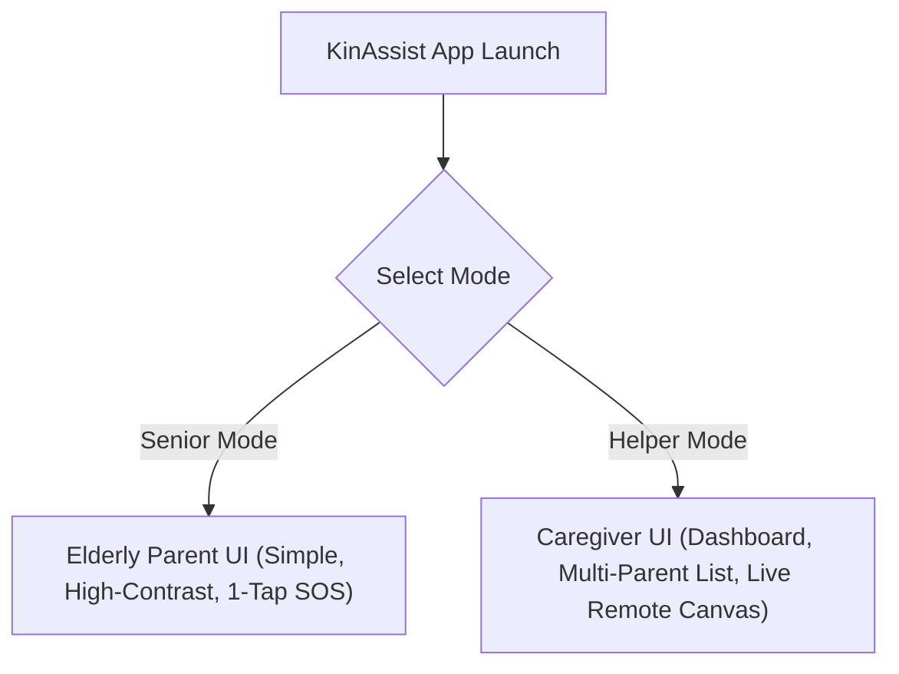
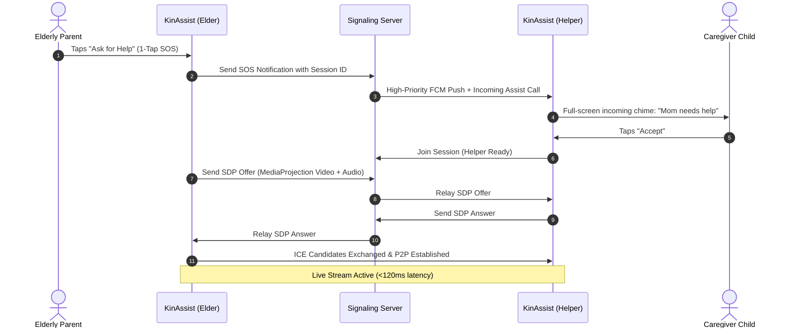

# Product Requirements Document (PRD)
## KinAssist: 1-Tap Remote Elderly Assistance & Live Screen Pointer
**Platform:** Native Android (`minSdk 26` / Android 8.0 Oreo up to `targetSdk 35` / Android 15)  
**Language & UI Framework:** Kotlin 2.x • Jetpack Compose • Material 3  
**Architecture:** Clean Architecture + MVI (Unidirectional Data Flow)  
**Real-Time Media Protocol:** WebRTC (Peer-to-Peer, DTLS-SRTP Encrypted) + DataChannels  

---

## 1. Document Control & Metadata
- **Product Name:** KinAssist (Codename: *CarePointer*)
- **Target Release:** v1.0.0 MVP
- **Document Version:** v2.0.0
- **Document Status:** Engineering-Ready Specification
- **Primary Personas:**
  1. **Elderly Parent (Senior / Assisted User):** Needs instant, panic-free help with zero setup, big text, and zero jargon.
  2. **Adult Child / Caregiver (Remote Helper):** Needs instant low-latency visual access, live guiding visual pointers, and audio intercom to guide without taking aggressive control.

---

## 2. Product Vision & Strategy

### 2.1 The Core Problem
Elderly parents frequently get stuck in complex smartphone flows:
- Hidden system settings, permission dialogs, UPI/banking error prompts, accidental DND toggles, font size changes, and app updates.
- **Why Phone Calls Fail:** Explaining *"Ab right side me jo teen dot hain uspar tap karo"* over a voice call is agonizingly slow, frustrating for both sides, and usually results in parents clicking the wrong buttons or hanging up in panic.
- **Why Existing Tools (TeamViewer, AnyDesk, WhatsApp Screen Share) Fail:**
  - *TeamViewer / AnyDesk:* Intimidating 9-digit security codes, complex permission traps, aggressive full-device takeover (often triggering fraud alerts), and heavy battery drain.
  - *WhatsApp Screen Share:* Video is buried 4 menus deep, audio frequently cuts out, and the child **cannot point or draw on the parent's screen**, leaving them still shouting verbal directions over a laggy stream.

### 2.2 The 10× Delta & Product Vision
**KinAssist** transforms remote family assistance into a **1-Tap Visual Guidance Bridge**:
1. **1-Tap SOS Connection:** The parent opens the app and taps one massive button: **"Call for Help"**. Their paired child gets an instant high-priority ring.
2. **Live Visual Pointer Overlay (Not Intrusive Takeover):** Instead of grabbing control from the parent, the helper taps on their screen and a **luminous guiding arrow / pulsing ripple target appears live on the parent's phone screen** over whichever app they are in. The parent taps where the arrow points. This builds user confidence and preserves agency.
3. **Integrated Low-Latency Voice Intercom:** Clear, hands-free speakerphone audio alongside the video feed so conversation flows naturally.
4. **Anti-Scam Privacy Shield:** Sensitive banking apps and password fields automatically trigger an on-device privacy blackout, ensuring family assistance never exposes financial credentials.

### 2.3 Success Metrics (KPIs)
- **Time-to-Session (TTS):** `< 4 seconds` from parent tapping SOS to child seeing live feed on standard 4G/Wi-Fi.
- **Glass-to-Glass Latency:** `< 120ms` round-trip for screen stream and pointer coordinate rendering.
- **Task Completion Rate:** `> 92%` of elderly user issues resolved in under 3 minutes without verbal confusion.
- **Crash-Free Sessions:** `> 99.8%` with zero memory leaks during extended `MediaProjection` streaming.

---

## 3. Dual-Mode User Personas & Experience

The application packages two distinct modes into a single APK, selected during the simple 1-time setup:



### 3.1 Senior Mode (Parent Experience)
- **Extreme Simplicity:** Only 1 primary action screen. No multi-level navigation.
- **Accessibility Baseline:** Minimum font size `18sp`, primary touch targets `> 64dp`, WCAG AAA contrast ratio (`> 7:1`).
- **Floating Status Pill:** While streaming, a non-intrusive floating pill indicates: *"Connected with [Son's Name] • Tap to Disconnect"*.
- **Zero-Password Reconnection:** Paired once via a simple QR code or 6-digit family invite code.

### 3.2 Helper Mode (Caregiver Experience)
- **Live Stream Canvas:** High-resolution, low-latency screen mirror of the parent's device.
- **Pointer Tools:**
  - *Tap-to-Point:* Tapping spawns an animated arrow pointing downwards with an expanding ripple.
  - *Doodle / Circle:* Draw a quick circle around a button or toggle; the doodle fades away after 3 seconds.
  - *Numbered Steps:* Drop "1", "2", "3" badge markers for sequential tasks.
- **Remote Device Telemetry:** Live battery level, Wi-Fi/cellular signal strength, volume level, and DND status of the parent's phone.
- **Remote Assist Actions:** Soft Accessibility triggers for **Back**, **Home**, **Recent Apps**, and **Pull Down Notifications** (for when the parent is completely frozen in an unresponsive screen).

---

## 4. Scope & Feature Prioritization (MoSCoW Matrix)

### P0 — Must-Have (MVP Scope)
1. **1-Tap Pairing & WebRTC Signaling:**
   - 1-time pairing via QR Code or short Family PIN.
   - Automated WebRTC peer connection setup with Google STUN + Coturn TURN relay fallback for strict symmetric NAT/firewalls.
2. **MediaProjection Screen Streamer:**
   - Hardware-accelerated screen capture via `MediaProjection` and `VirtualDisplay`.
   - Adaptive resolution & bitrate: dynamically shifts between 720p 30fps and 480p 20fps based on mobile network conditions.
3. **Live Remote Pointer & Gesture Overlay Engine:**
   - Floating system window using Android `WindowManager.LayoutParams.TYPE_APPLICATION_OVERLAY`.
   - Real-time rendering of animated pointer arrows, tap circles, and gesture hints driven by coordinate packets sent over WebRTC DataChannel.
4. **Full-Duplex VoIP Audio Intercom:**
   - Low-latency voice communication (Opus codec, 16kHz–48kHz) with Acoustic Echo Cancellation (AEC) so child and parent speak hands-free.
5. **Senior-Optimized Interface:**
   - Tactile, large-format UI with instant haptic confirmations and spoken audio prompts (e.g., *"Connecting to your son..."*).

### P1 — Should-Have (Production-Ready Polish)
1. **Accessibility Service Remote Navigation (Assisted Rescue):**
   - Optional `AccessibilityService` integration allowing helper to perform `GLOBAL_ACTION_BACK`, `GLOBAL_ACTION_HOME`, and `GLOBAL_ACTION_NOTIFICATIONS` with explicit senior consent.
2. **Anti-Scam Guardian & Privacy Blackout:**
   - Real-time detection of foreground packages (banking apps, UPI apps) via Accessibility; automatically blanks the screen feed to black with a shield: *"Screen hidden for privacy"*.
3. **Remote Hardware & Status Telemetry:**
   - Battery %, charging status, Wi-Fi name & signal strength, ringer mode (Silent/DND) sent to helper dashboard.
4. **High-Priority Remote Wake-Up (Loud Ring):**
   - Helper can send an override chime through FCM high-priority message if the parent's phone is on silent and they aren't responding.
5. **Temporary Disappearing Doodles:**
   - Helper can draw freehand lines/circles on the screen mirror that replicate on the parent's overlay and dissolve within 2.5 seconds.

### P2 — Nice-to-Have (Fast Follow-Up)
1. **Web-Based Helper Portal:**
   - Adult child can open `assist.kinassist.app` on their laptop browser and assist their parent via WebRTC without needing an Android phone.
2. **Session Step Recap (Family Memory Card):**
   - Saves a 3-step visual checklist of the solution (e.g., *"How to connect to Home Wi-Fi"*) for the parent to review later.
3. **Pre-Configured Emergency Quick Actions:**
   - 1-tap parent buttons to launch common apps with auto-guidance: "Call Doctor", "Open WhatsApp Video", "Recharge Metro Card".

### Anti-Scope (Strictly Excluded)
- ❌ **No Unattended Stealth Surveillance:** The parent's phone must NEVER stream without explicit on-screen visual confirmation and an un-dismissible notification.
- ❌ **No Unrestricted Remote Keystroke / Password Control:** The helper cannot type into password or credential fields.
- ❌ **No Cloud Video Storage:** Zero video is recorded or stored on remote servers; all streams are ephemeral peer-to-peer.

---

## 5. Technical Architecture & Constraints

```mermaid
flowchart TD
    subgraph ElderDevice ["Elderly Parent Android Device"]
        SeniorUI["Senior Compose UI"] -->|1-Tap SOS| SessionMgr["Session Manager"]
        MediaProj["MediaProjection API"] -->|Video Frames| VEncoder["Hardware H.264 Encoder"]
        Mic["Microphone"] -->|Audio| AEncoder["Opus Audio Engine"]
        VEncoder & AEncoder --> PeerConn1["WebRTC PeerConnection"]
        OverlaySvc["Floating Overlay Service (TYPE_APPLICATION_OVERLAY)"] <--|Pointer Packets| DataCh1["WebRTC DataChannel"]
        AccessSvc["Accessibility Service (Rescue & Anti-Scam)"] -->|Window State Checks| SessionMgr
    end

    subgraph SignalingLayer ["Signaling & NAT Traversal"]
        PeerConn1 <-->|SDP Offer/Answer via WSS| SignalSvr["WebSocket Signaling Server"]
        SignalSvr <-->|SDP Offer/Answer| PeerConn2["Helper WebRTC PeerConnection"]
        PeerConn1 & PeerConn2 <-->|ICE / STUN / TURN| Coturn["Coturn Relay (NAT Traversal)"]
    end

    subgraph HelperDevice ["Helper / Caregiver Android Device"]
        PeerConn2 -->|Decoded Stream| SurfaceView["Compose Video SurfaceView"]
        TouchCanvas["Touch & Gesture Canvas"] -->|Normalized Coordinates (x,y)| DataCh2["WebRTC DataChannel"]
        DataCh2 <--> DataCh1
        SurfaceView & TouchCanvas --> HelperUI["Helper Assist Dashboard"]
    end
```

### 5.1 Technology Stack Selection
| Layer | Technology | Engineering Justification |
| :--- | :--- | :--- |
| **Language** | Kotlin 2.1.x | Modern memory safety, coroutines, and native Android platform APIs. |
| **UI Framework** | Jetpack Compose + Material 3 | Declarative UI, dynamic scaling for accessibility, frictionless animation. |
| **Screen Streaming** | Android `MediaProjection` API | Low-overhead OS screen frame capture via `VirtualDisplay`. |
| **Real-Time Protocol** | Google WebRTC (`org.webrtc`) | Sub-150ms latency, automatic adaptive bitrate, built-in AEC/audio processing, hardware H.264/VP8. |
| **Data Synchronization** | WebRTC DataChannels (SCTP) | Ultra-low latency (`<30ms`) transmission of pointer coordinates, touch ripples, and telemetry. |
| **Live Visual Overlays** | `TYPE_APPLICATION_OVERLAY` + Canvas | Draws animated floating pointer arrows directly over any running app. |
| **Rescue Navigation** | Android `AccessibilityService` | Provides `GLOBAL_ACTION_BACK`, `GLOBAL_ACTION_HOME`, and window monitoring. |
| **Push & Signaling** | Ktor Client WebSocket + FCM | Lightweight signaling with zero background battery drain when idle. |

### 5.2 Latency, Battery & Memory Constraints
- **Memory Ceiling:** Peak RSS under `95MB` during 1080p/720p hardware streaming.
- **Battery Impact:** Foreground streaming service strictly terminates when session ends; zero background polling.
- **Frame Rate Tuning:** Target 25–30 FPS for screen capture; automatically throttles to 15 FPS if battery drops below 15% or device reports thermal throttling (`PowerManager.getThermalHeadroom()`).

---

## 6. UI/UX Design Language & Neutral Premium Aesthetic

*(Guidelines crafted for your Stitch UI prompts and custom styling)*

### 6.1 Brand Identity & Design Personality
- **Emotional Tone:** Dignified, calming, trustworthy, and premium. Not clinical or condescendingly "child-like", but refined luxury with maximum readability.
- **Aesthetic Movement:** **Warm Neutral Luxury / Contemporary Scandinavian Minimalism**. Soft charcoal and cashmere canvas, warm slate containers, and champagne-gold or deep sapphire accents.

### 6.2 Neutral Premium Color Architecture

```
Canvas / Deep Background:       #0F1115 (OLED Deep Slate / Pitch Charcoal)
Surface Level 1 (Cards):        #181B20 (Warm Charcoal Container)
Surface Level 2 (Elevated):     #22262E (Interactive Surfaces & Floating Sheets)
Hairline Borders:               #2F343E (Refined 1px technical outlines)

Typography Primary:             #F5F6F8 (Pure warm white for maximum legibility)
Typography Muted / Secondary:   #9CA3AF (Subtle cool gray for helper metadata)

Accent 1 (Champagne Gold):      #D4AF37 (Elegance, active connections, key highlights)
Accent 2 (Warm Terracotta/SOS): #E06C53 / #EF4444 (High-visibility emergency trigger)
Live Pointer Color:             #10B981 (Luminous Emerald) / #06B6D4 (Electric Cyan Glow)
```

### 6.3 Screen Hierarchy for UI Design
1. **Senior Home Screen:**
   - Minimalist header with paired status: *"Connected to Rahul (Son)"*.
   - Centerpiece: Massive circular or pill tactile button: **"Ask for Help"** with pulsing warm ring.
   - Status micro-card: *"Battery 82% • Volume Normal • Ready"*.
2. **Helper Dashboard & Remote Screen:**
   - Full-bleed video stream of parent's screen with rounded bezel simulation.
   - Floating Pointer Dock at bottom:
     - Tool 1: **Pointer Arrow** (default tap).
     - Tool 2: **Circle Highlight** (doodle ink).
     - Tool 3: **Voice Mute/Unmute**.
     - Tool 4: **Rescue Actions** (Back, Home, Notifications).
   - Top Bar: Parent device telemetry (Battery, Signal, Network latency: `42ms`).
3. **Floating Overlay on Parent Device:**
   - Luminous animated arrow pointing directly at target UI elements with an expanding circular ripple wave.
   - Mini pill at top-right: *"Rahul is helping • [End Session]"*.

---

## 7. Data Flow & Communication Protocol

### 7.1 Signaling & Connection Sequence


### 7.2 DataChannel Pointer Event Packet Schema
When the helper touches their screen mirror, a normalized event is sent instantly:
```json
{
  "type": "POINTER_TAP",
  "version": 1,
  "xRatio": 0.4285,
  "yRatio": 0.6712,
  "pointerStyle": "ARROW_PULSE",
  "colorHex": "#10B981",
  "durationMs": 3500,
  "timestamp": 1727193307123
}
```
*Note: Using `xRatio` and `yRatio` (0.0 to 1.0) ensures mathematical pixel-perfection across different phone screen resolutions and aspect ratios.*

---

## 8. Security, Privacy & Permission Recovery

### 8.1 Required Android Permissions & Strategic Justification
1. `android.permission.FOREGROUND_SERVICE_MEDIA_PROJECTION`: Mandatory on Android 10+ for screen capture services. Accompanied by a persistent notification.
2. `android.permission.SYSTEM_ALERT_WINDOW`: Mandatory to render the live guiding arrows on top of other third-party apps.
3. `android.permission.RECORD_AUDIO`: For real-time hands-free family voice intercom during assist sessions.
4. `android.permission.BIND_ACCESSIBILITY_SERVICE` (Optional / Assisted Rescue): Used strictly for navigation rescue (Back/Home) and foreground banking app detection.

### 8.2 Guardian Privacy Engine (Anti-Fraud)
- **Automatic Package Blackout:** A local blacklist of known banking/financial app package names (`com.google.android.apps.nbu.paisa.user`, `net.one97.paytm`, `com.phonepe.app`, etc.) is maintained.
- When an active package matches, the video capturer immediately switches to a static secure graphic: **"Protected App: Screen Paused for Privacy"**.
- Hardware `FLAG_SECURE` compliance ensures that even if an app is not on the list, protected fields render as black rectangles automatically.

---

## 9. Phased Execution Roadmap

### Phase 1: Specifications & UI System (Current)
- Complete PRD definition (This document).
- User generates custom, high-fidelity UI screens on Stitch using the defined neutral luxury palette.

### Phase 2: Core Engineering Foundation
- Scaffolding multi-module Native Android project (`:app`, `:core:webrtc`, `:core:overlay`, `:core:accessibility`, `:core:designsystem`).
- WebRTC PeerConnection engine + Ktor WebSocket signaling client.
- MediaProjection service & hardware video encoder pipeline.

### Phase 3: Live Pointer & Interaction Engine
- Floating Window Overlay manager using Jetpack Compose in a floating `WindowManager` container.
- High-frequency pointer packet receiver via WebRTC DataChannel.
- Animated ripple arrow & gesture marker canvas.

### Phase 4: Senior Accessibility & Polish
- Audio Intercom integration with AEC.
- Anti-scam banking screen auto-blackout.
- Pair-once QR Code generator and family link storage via EncryptedSharedPreferences.
- Battery and network telemetry broadcast.
